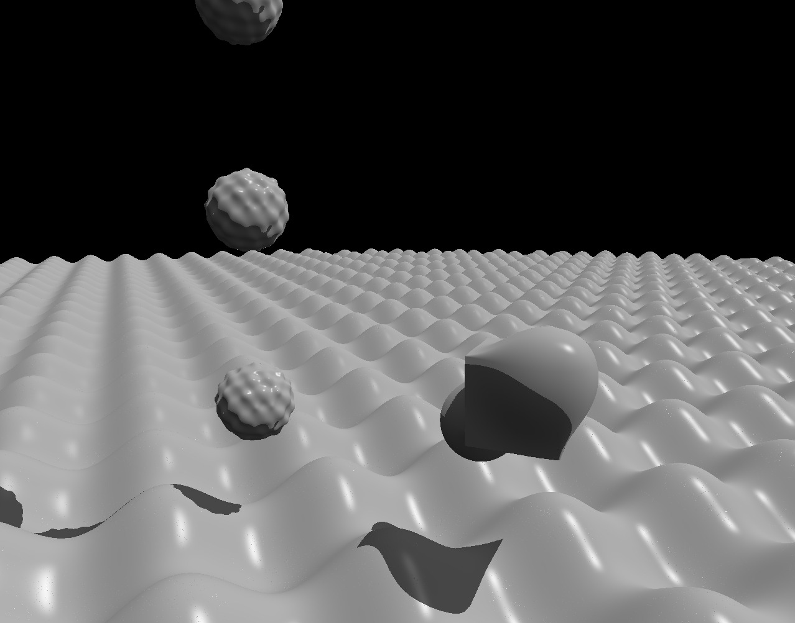

# Ray Marching

Simple ray marching animated demo written on C++ with SDL2 library.

## Compile
`
make
`

## Run
`
make run
`

## Clean
`
make clean
`

## Controls
| Key        | Description |
| ---------- | ----------- |
| W,A,S,D    | movement    |
| Left Shift | speed up    |
